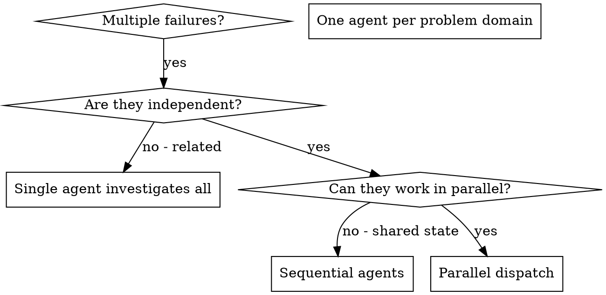

# Dispatching Parallel Agents

## Purpose

You delegate tasks to specialized agents with isolated context. By precisely crafting their instructions and context, you ensure they stay focused and succeed at their task. They should never inherit your session's context or history — you construct exactly what they need. This also preserves your own context for coordination work.

When you have multiple unrelated failures (different test files, different subsystems, different bugs), investigating them sequentially wastes time. Each investigation is independent and can happen in parallel.

**Core principle:** Dispatch one agent per independent problem domain. Let them work concurrently.

### Key Benefits

1. **Parallelization** - Multiple investigations happen simultaneously
2. **Focus** - Each agent has narrow scope, less context to track
3. **Independence** - Agents don't interfere with each other
4. **Speed** - 3 problems solved in time of 1

### When to Use



**Use when:**
- 3+ test files failing with different root causes
- Multiple subsystems broken independently
- Each problem can be understood without context from others
- No shared state between investigations

## Trigger Contract

### Use this skill when
- The user has 2+ independent tasks that can run concurrently
- Tasks have no shared state or sequential dependencies
- Multiple failures in different files/subsystems that are unrelated
- Each problem domain can be understood in isolation
- User wants to reduce overall execution time through parallelization

### Do NOT use this skill when
- Failures are related (fixing one might fix others)
- Need to understand full system state before proceeding
- Exploratory debugging where root cause is unknown
- Agents would interfere with each other (editing same files, using same resources)
- Tasks require shared context or state between them

### Inspect First
- Check if failures are actually independent by examining error messages
- Verify no shared state between the problem domains
- Confirm agents can be dispatched with isolated contexts

### Handoff To
- Sequential agent skill if tasks must run in order
- Single agent skill if there's only one problem to solve

### Stop Conditions
- All tasks are dependent on each other
- Shared state prevents parallel execution
- Insufficient context to dispatch agents independently

## When Not to Use

### Common Misactivation Scenarios

**Don't use for:**
- Related failures where fixing one might fix others
- Tasks requiring full system state understanding
- Exploratory debugging (root cause unknown)
- Single task that one agent can handle
- Tasks with explicit sequential dependencies

### Alternative Approaches

| Request | Use Instead |
|---------|-------------|
| "Debug this single failure" | Single agent dispatch |
| "Fix these related bugs" | Sequential investigation |
| "Explore the codebase" | Explore skill or single agent |
| "Understand the system" | Analysis skill |

## Inputs

### Required Inputs
- List of independent tasks or problem domains to address
- Clear scope definition for each task
- Expected output format from each agent

### Optional Inputs
- Specific constraints for each agent (e.g., "don't change production code")
- Context files or error messages to pass to agents
- Priority ordering if tasks have different urgency
- Timeline constraints

### Input Formats
- Natural language description of tasks
- List of failing test files with error summaries
- Problem domain descriptions with constraints

## Output Contract

### Output Mode
- Agent dispatch commands
- Summary of dispatched agents and their scopes
- Coordination plan for integration after agents return

### Required Outputs
- One agent dispatched per independent problem domain
- Each agent has:
  - **Specific scope:** One test file or subsystem
  - **Clear goal:** What success looks like
  - **Constraints:** What not to change
  - **Expected output:** Summary format to return

### Agent Prompt Structure

Good agent prompts are:
1. **Focused** - One clear problem domain
2. **Self-contained** - All context needed to understand the problem
3. **Specific about output** - What should the agent return?

```markdown
Fix the 3 failing tests in src/agents/agent-tool-abort.test.ts:

1. "should abort tool with partial output capture" - expects 'interrupted at' in message
2. "should handle mixed completed and aborted tools" - fast tool aborted instead of completed
3. "should properly track pendingToolCount" - expects 3 results but gets 0

These are timing/race condition issues. Your task:

1. Read the test file and understand what each test verifies
2. Identify root cause - timing issues or actual bugs?
3. Fix by:
   - Replacing arbitrary timeouts with event-based waiting
   - Fixing bugs in abort implementation if found
   - Adjusting test expectations if testing changed behavior

Do NOT just increase timeouts - find the real issue.

Return: Summary of what you found and what you fixed.
```

### Integration After Agents Return

1. **Review each summary** - Understand what changed
2. **Check for conflicts** - Did agents edit same code?
3. **Run full suite** - Verify all fixes work together
4. **Spot check** - Agents can make systematic errors

### Common Mistakes to Avoid

**❌ Too broad:** "Fix all the tests" - agent gets lost
**✅ Specific:** "Fix agent-tool-abort.test.ts" - focused scope

**❌ No context:** "Fix the race condition" - agent doesn't know where
**✅ Context:** Paste the error messages and test names

**❌ No constraints:** Agent might refactor everything
**✅ Constraints:** "Do NOT change production code" or "Fix tests only"

**❌ Vague output:** "Fix it" - you don't know what changed
**✅ Specific:** "Return summary of root cause and changes"

### Failure Output
If dispatch fails:
- reason: Why dispatch couldn't proceed
- alternative: Sequential approach suggestion

## Risk and Safety Boundaries

### Risk Level
**medium** - Spawns subagents that modify code/files, but within controlled scope

### Trust Boundaries

| Boundary | Trust Level | Notes |
|----------|-------------|-------|
| Agent instructions | Trusted | You craft what agents receive |
| Agent output | Review required | Always verify before integrating |
| Agent file changes | Review required | Check for unintended modifications |
| External systems | Untrusted | Agents shouldn't access external services without explicit instruction |

### Primary Risks

| Risk | Mitigation |
|------|------------|
| Agent makes unwanted changes | Define explicit constraints in prompt |
| Agent fixes conflict | Review all changes before integration |
| Agent misunderstands scope | Use focused, specific prompts |
| Agent introduces bugs | Run full test suite after integration |
| Context leakage | Ensure agents get isolated context, not session history |

### Basic Safety Rules
1. Always define constraints - what NOT to change
2. Require summary output from each agent
3. Review all changes before integrating
4. Run verification tests after agents return

### Approval Requirements
- Medium risk: Review changes before integration
- High risk: Not applicable (would use different skill)

## Failure Taxonomy

### Standard Failure Classes

| Class | Description | Resolution |
|-------|-------------|------------|
| ambiguous_tasks | Tasks not clearly independent | Clarify task boundaries |
| shared_state_detected | Tasks have hidden dependencies | Switch to sequential approach |
| context_insufficient | Not enough info to dispatch agents | Gather more context first |
| agent_timeout | Agent takes too long | Re-dispatch with narrower scope |
| conflict_detected | Agents edited same files | Manual merge required |
| verification_failed | Integration breaks existing tests | Request agent to fix |

### Expected Failure Behavior

Each dispatch should:
1. Verify tasks are truly independent
2. Provide clear constraints to each agent
3. Plan for integration review
4. Have fallback to sequential if parallel fails

### Minimum Failure Handling
- **ambiguous_tasks**: Ask user to clarify task boundaries
- **shared_state_detected**: Switch to single agent or sequential approach
- **context_insufficient**: Gather more information before dispatch
- **conflict_detected**: Manual review required, potentially re-dispatch

## Minimal Context Rules

### Core Required Context

Before using this skill, the following must be known:

| Information | Source | Required |
|-------------|--------|----------|
| List of independent tasks | User request | Yes |
| Scope of each task | User request | Yes |
| Constraints for agents | User request | Yes |
| Expected output format | Output Contract section | Yes |

### Context Principle

This skill is lightweight - the main context is the task descriptions you craft. Agents receive:
- Their specific scope and goal
- Relevant error messages/tests
- Constraints and output format

Your coordination context remains small because agents handle the detailed work.

## Minimum Observability

### Required Logging

| Event | Description |
|-------|-------------|
| **Trigger** | When parallel dispatch is activated |
| **Dispatch** | Each agent dispatched with scope |
| **Completion** | When agents return with results |
| **Integration** | When changes are integrated |
| **Failure** | Any dispatch or integration failure |

### Logging Format

Log in simple text format:
- Dispatch: "Dispatched agent for {scope}"
- Completion: "Agent completed {scope}: {summary}"
- Failure: "Failed: {reason}, trying {alternative}"

## Version Metadata

This skill follows semantic versioning:
- **PATCH** for corrections to dispatch patterns
- **MINOR** for new coordination techniques
- **MAJOR** for structural changes to the skill

### Version History

| Version | Change |
|---------|--------|
| 1.1.0 | Upgraded to Skill Creator v2.4.0 spec |
| 1.0.0 | Initial release |

---

## The Pattern (Reference)

### 1. Identify Independent Domains

Group failures by what's broken:
- File A tests: Tool approval flow
- File B tests: Batch completion behavior
- File C tests: Abort functionality

Each domain is independent - fixing tool approval doesn't affect abort tests.

### 2. Create Focused Agent Tasks

Each agent gets:
- **Specific scope:** One test file or subsystem
- **Clear goal:** Make these tests pass
- **Constraints:** Don't change other code
- **Expected output:** Summary of what you found and fixed

### 3. Dispatch in Parallel

```typescript
// In Claude Code / AI environment
Task("Fix agent-tool-abort.test.ts failures")
Task("Fix batch-completion-behavior.test.ts failures")
Task("Fix tool-approval-race-conditions.test.ts failures")
// All three run concurrently
```

### 4. Review and Integrate

When agents return:
- Read each summary
- Verify fixes don't conflict
- Run full test suite
- Integrate all changes

---

## Timeline Estimation for Parallel Dispatch (Reference)

When dispatching parallel agents, estimate total time differently:

**Sequential Time (without parallelization):**
```
TOTAL = Task1 + Task2 + Task3 + ...
```

**Parallel Time (with parallelization):**
```
TOTAL = MAX(Task1, Task2, Task3, ...) + Coordination + Integration
```

| Factor | Time Estimate |
|--------|---------------|
| Agent dispatch overhead | 5-15 seconds per agent |
| Context loading per agent | 1-3 minutes per agent |
| Coordination (your time) | 10-30 minutes |
| Integration after return | 15-60 minutes |
| Verification of all fixes | 10-30 minutes |

**Example:**
- 3 independent tasks, each 30-45 minutes
- Sequential: 90-135 minutes
- Parallel: MAX(45 min) + 10 min dispatch + 30 min integration = ~85 minutes
- **Savings: 5-50 minutes**

**Use `ai-timeline-estimation` skill for each task, then calculate parallel vs sequential.**

---

## Real Example from Session (Reference)

**Scenario:** 6 test failures across 3 files after major refactoring

**Failures:**
- agent-tool-abort.test.ts: 3 failures (timing issues)
- batch-completion-behavior.test.ts: 2 failures (tools not executing)
- tool-approval-race-conditions.test.ts: 1 failure (execution count = 0)

**Decision:** Independent domains - abort logic separate from batch completion separate from race conditions

**Dispatch:**
```
Agent 1 → Fix agent-tool-abort.test.ts
Agent 2 → Fix batch-completion-behavior.test.ts
Agent 3 → Fix tool-approval-race-conditions.test.ts
```

**Results:**
- Agent 1: Replaced timeouts with event-based waiting
- Agent 2: Fixed event structure bug (threadId in wrong place)
- Agent 3: Added wait for async tool execution to complete

**Integration:** All fixes independent, no conflicts, full suite green

**Time saved:** 3 problems solved in parallel vs sequentially