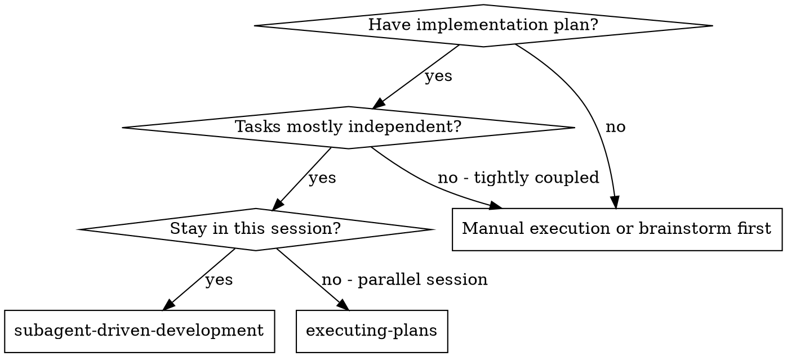
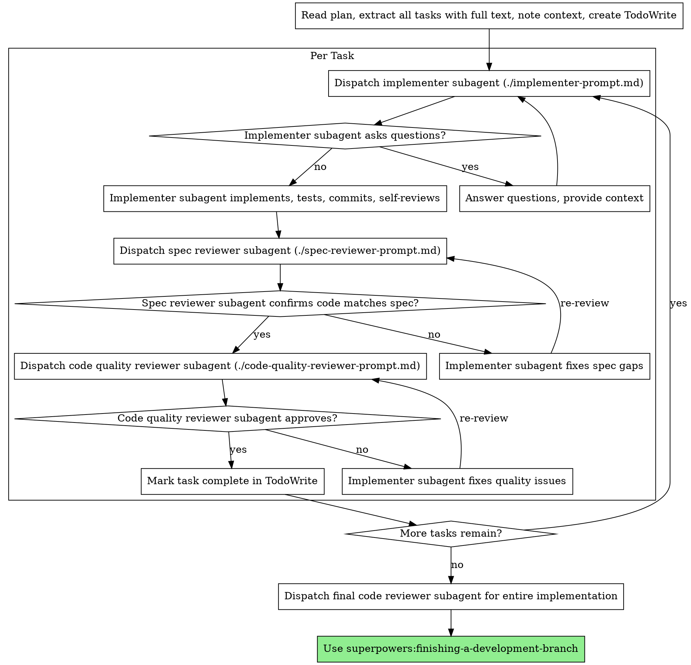

# Subagent-Driven Development

## Purpose

Execute plan by dispatching fresh subagent per task, with two-stage review after each: spec compliance review first, then code quality review.

**Why subagents:** You delegate tasks to specialized agents with isolated context. By precisely crafting their instructions and context, you ensure they stay focused and succeed at their task. They should never inherit your session's context or history — you construct exactly what they need. This also preserves your own context for coordination work.

**Core principle:** Fresh subagent per task + two-stage review (spec then quality) = high quality, fast iteration

**What this skill does:**
- Reads implementation plans and extracts tasks with full context
- Dispatches implementer subagents per task with curated context
- Runs two-stage review: spec compliance first, then code quality
- Coordinates iteration cycles until reviews pass
- Tracks progress via TodoWrite
- Uses model selection based on task complexity

## Trigger Contract

### Use this skill when
- User asks to execute an implementation plan with multiple independent tasks
- Implementation plan has clear tasks that can be executed in isolation
- User wants to stay in the current session (not create parallel session)
- User mentions "subagent-driven development", "execute plan with subagents", or similar
- Plan is well-specified and tasks are mostly independent

### Do NOT use this skill when
- No implementation plan exists (use planning skills first)
- Tasks are tightly coupled and require shared context between them
- User wants to execute in a parallel session (use executing-plans skill)
- One-off implementation without plan (just implement directly)
- Brainstorming or manual execution first (don't use subagents)

### Inspect First
- Implementation plan file and structure
- Number of tasks and dependencies
- Required prompt templates (implementer-prompt.md, spec-reviewer-prompt.md, code-quality-reviewer-prompt.md)
- Available model tiers for task assignment

### Handoff To
- `superpowers:writing-plans` for creating the plan this skill executes
- `superpowers:executing-plans` for parallel session execution instead
- `superpowers:finishing-a-development-branch` after all tasks complete

### Stop Conditions
- Plan file missing or unreadable
- No tasks extracted from plan
- Subagent repeatedly BLOCKED without resolution path
- User explicitly stops the process

## When Not to Use

### Common Misactivation Scenarios

**Don't use for:**
- Tightly coupled tasks requiring shared context between subagents
- Plans that need parallel session execution
- One-off manual implementation without structured plan
- Brainstorming or exploratory work
- Debugging existing code (use systematic debugging)

### Alternative Skills

| Request | Use Instead |
|---------|-------------|
| "Execute plan in parallel session" | superpowers:executing-plans |
| "Create an implementation plan" | superpowers:writing-plans |
| "Debug this issue" | Systematic debugging |
| "Implement this directly" | Manual execution (no skill needed) |
| "Finish the development branch" | superpowers:finishing-a-development-branch |

## Inputs

### Required Inputs
- Implementation plan (file or text)
- Access to prompt templates (implementer-prompt.md, spec-reviewer-prompt.md, code-quality-reviewer-prompt.md)
- Git worktree setup capability
- TodoWrite tool for task tracking

### Optional Inputs
- Model preference by task complexity
- Timeline constraints
- Specific review criteria

### Input Formats
- Plan file path or markdown content
- Task list as structured information
- Context details: files to modify, dependencies, constraints

## Output Contract

### Output Mode
- Complete task execution through subagents
- Git commits per task
- Task completion status in TodoWrite
- Final code review summary

### Required Artifacts
- Each task implemented and committed
- Spec compliance review passed
- Code quality review passed
- Progress tracked in TodoWrite

### Output Guarantees
- Fresh subagent context per task (no context pollution)
- Two-stage review process enforced
- Review loops until approval
- Model selection appropriate to task complexity

### Validation Rules
- Must use git worktrees for isolation
- Must complete spec review before code quality review
- Must not skip review iterations
- Must track progress in TodoWrite

### Failure Output
- Status report: DONE, DONE_WITH_CONCERNS, NEEDS_CONTEXT, BLOCKED
- Specific blocker reason if BLOCKED
- Recommended next action based on status

## Risk and Safety Boundaries

### Risk Level
**medium** - Executes code changes via subagents, uses git worktrees for isolation

### Trust Boundaries

| Boundary | Trust Level | Notes |
|----------|-------------|-------|
| User request | Trusted | User explicitly requests execution |
| Implementation plan | Moderate | Validate against existing codebase |
| Subagent output | Verify via review | Always review before acceptance |
| Git operations | Isolated via worktrees | No direct branch modifications |

### Primary Risks

| Risk | Mitigation |
|------|------------|
| Incorrect implementation | Two-stage review (spec + quality) catches issues |
| Context pollution | Fresh subagent per task, no inheritance |
| Branch conflicts | Git worktree isolation required |
| Subagent misunderstanding | Review loops until correct |
| Over/under implementation | Spec compliance review verifies scope |

### Basic Safety Rules
1. Always use git worktrees for task isolation
2. Never skip reviews or review iterations
3. Use appropriate model tier for task complexity
4. Never proceed with unfixed review issues
5. Track all progress in TodoWrite
6. Start on main/master only with explicit user consent

## Failure Taxonomy

### Standard Failure Classes

| Class | Description | Resolution |
|-------|-------------|------------|
| missing_input | Required context not provided | Provide context, re-dispatch subagent |
| ambiguous_task | Task scope unclear | Clarify with user, update plan |
| implementation_blocked | Subagent cannot complete task | Re-dispatch with more context or better model |
| spec_violation | Code doesn't match spec | Implementer fixes, re-review |
| quality_issues | Code quality problems | Implementer fixes, re-review |
| review_timeout | Review takes too long | Check if subagent is stuck, intervene |
| git_conflict | Worktree conflict | Resolve conflict manually |

### Expected Failure Behavior

For each task execution:
1. Implementer reports status: DONE, DONE_WITH_CONCERNS, NEEDS_CONTEXT, BLOCKED
2. If BLOCKED, assess and re-dispatch appropriately
3. Implementer fixes issues found in review
4. Re-review until approvals
5. Never skip iteration or proceed with issues

### Minimum Failure Handling
- **NEEDS_CONTEXT**: Provide missing context, re-dispatch same model
- **BLOCKED**: Re-dispatch with more capable model or break task
- **spec_violation**: Implementer fixes, spec reviewer re-reviews
- **quality_issues**: Implementer fixes, quality reviewer re-reviews

## Minimal Context Rules

### Core Required Context

Before using this skill, the following must be known:

| Information | Source | Required |
|-------------|--------|----------|
| Implementation plan | User or file | Yes |
| Task list with full text | Extracted from plan | Yes |
| Prompt templates | Skill files | Yes |
| Git worktree setup | Skill requirement | Yes |
| Review criteria | Prompt templates | Yes |

### Context Principle

The controller (main agent) does the heavy lifting:
- Extracts all tasks with full context upfront
- Curates exactly what each subagent needs
- Provides complete information before dispatch

Subagents receive focused context for their specific task, not the entire plan.

### What Goes in Subagent Context
- Task description with full text
- Relevant files and code snippets
- Dependencies and constraints
- Specific instructions from plan
- Scene-setting: where this task fits in overall implementation

### What Stays with Controller
- Overall plan progress
- Task interdependencies
- Coordination state
- TodoWrite tracking

## Minimum Observability

### Required Logging

Every subagent execution should log:

| Event | Description |
|-------|-------------|
| **Trigger** | Task dispatched to implementer subagent |
| **Action** | Implementation completed, review started |
| **Failure** | Review issues found, re-review cycle |

### Logging Format

Simple text logs are sufficient:
- Task start: "Dispatching implementer for [task name]"
- Review: "Spec review: [PASS/FAIL], Code quality: [PASS/FAIL]"
- Completion: "Task [N] complete: [commit SHA]"

## Version Metadata

| Field | Value | Purpose |
|-------|-------|---------|
| version | 1.1.0 | Current skill version |
| skill_schema_version | 1 | Schema identifier |
| deprecated | false | Active skill |
| replaced_by | null | Not deprecated |
| minimum_openclaw_version | 1.0.0 | Compatibility minimum |
| supported_models | general | Universal applicability |
| preferred_model_traits | strong coordination, task planning | Optimal model characteristics |

### Versioning Rules
This skill follows semantic versioning:
- PATCH: Bug fixes, documentation improvements
- MINOR: New features, workflow enhancements
- MAJOR: Structural changes, breaking modifications

---

## When to Use



**vs. Executing Plans (parallel session):**
- Same session (no context switch)
- Fresh subagent per task (no context pollution)
- Two-stage review after each task: spec compliance first, then code quality
- Faster iteration (no human-in-loop between tasks)

## The Process



## Model Selection

Use the least powerful model that can handle each role to conserve cost and increase speed.

**Mechanical implementation tasks** (isolated functions, clear specs, 1-2 files): use a fast, cheap model. Most implementation tasks are mechanical when the plan is well-specified.

**Integration and judgment tasks** (multi-file coordination, pattern matching, debugging): use a standard model.

**Architecture, design, and review tasks**: use the most capable available model.

**Task complexity signals:**
- Touches 1-2 files with a complete spec → cheap model
- Touches multiple files with integration concerns → standard model
- Requires design judgment or broad codebase understanding → most capable model

## Handling Implementer Status

Implementer subagents report one of four statuses. Handle each appropriately:

**DONE:** Proceed to spec compliance review.

**DONE_WITH_CONCERNS:** The implementer completed the work but flagged doubts. Read the concerns before proceeding. If the concerns are about correctness or scope, address them before review. If they're observations (e.g., "this file is getting large"), note them and proceed to review.

**NEEDS_CONTEXT:** The implementer needs information that wasn't provided. Provide the missing context and re-dispatch.

**BLOCKED:** The implementer cannot complete the task. Assess the blocker:
1. If it's a context problem, provide more context and re-dispatch with the same model
2. If the task requires more reasoning, re-dispatch with a more capable model
3. If the task is too large, break it into smaller pieces
4. If the plan itself is wrong, escalate to the human

**Never** ignore an escalation or force the same model to retry without changes. If the implementer said it's stuck, something needs to change.

## Prompt Templates

- `./implementer-prompt.md` - Dispatch implementer subagent
- `./spec-reviewer-prompt.md` - Dispatch spec compliance reviewer subagent
- `./code-quality-reviewer-prompt.md` - Dispatch code quality reviewer subagent

## Example Workflow

```
You: I'm using Subagent-Driven Development to execute this plan.

[Read plan file once: docs/superpowers/plans/feature-plan.md]
[Extract all 5 tasks with full text and context]
[Create TodoWrite with all tasks]

Task 1: Hook installation script

[Get Task 1 text and context (already extracted)]
[Dispatch implementation subagent with full task text + context]

Implementer: "Before I begin - should the hook be installed at user or system level?"

You: "User level (~/.config/superpowers/hooks/)"

Implementer: "Got it. Implementing now..."
[Later] Implementer:
  - Implemented install-hook command
  - Added tests, 5/5 passing
  - Self-review: Found I missed --force flag, added it
  - Committed

[Dispatch spec compliance reviewer]
Spec reviewer: ✅ Spec compliant - all requirements met, nothing extra

[Get git SHAs, dispatch code quality reviewer]
Code reviewer: Strengths: Good test coverage, clean. Issues: None. Approved.

[Mark Task 1 complete]

Task 2: Recovery modes

[Get Task 2 text and context (already extracted)]
[Dispatch implementation subagent with full task text + context]

Implementer: [No questions, proceeds]
Implementer:
  - Added verify/repair modes
  - 8/8 tests passing
  - Self-review: All good
  - Committed

[Dispatch spec compliance reviewer]
Spec reviewer: ❌ Issues:
  - Missing: Progress reporting (spec says "report every 100 items")
  - Extra: Added --json flag (not requested)

[Implementer fixes issues]
Implementer: Removed --json flag, added progress reporting

[Spec reviewer reviews again]
Spec reviewer: ✅ Spec compliant now

[Dispatch code quality reviewer]
Code reviewer: Strengths: Solid. Issues (Important): Magic number (100)

[Implementer fixes]
Implementer: Extracted PROGRESS_INTERVAL constant

[Code reviewer reviews again]
Code reviewer: ✅ Approved

[Mark Task 2 complete]

...

[After all tasks]
[Dispatch final code-reviewer]
Final reviewer: All requirements met, ready to merge

Done!
```

## Timeline Estimation

Each task has base execution time plus coordination overhead:

```
TASK_TOTAL = Base_Time + Context_Load + Review_Cycles + Coordination
```

| Component | Time Estimate |
|-----------|---------------|
| Context load (subagent reads context) | 1-3 minutes |
| Implementation (varies) | Use ai-timeline-estimation |
| Spec review cycle | 2-5 minutes per cycle |
| Code quality review cycle | 2-5 minutes per cycle |
| Coordination (your time) | 5-15 minutes per task |
| Fix cycles (if issues found) | 5-15 minutes each |

**Example Task Estimate:**
| Task | Base Est. | Context | Reviews | Fix Cycles | Total |
|------|-----------|---------|---------|------------|-------|
| Hook installation | 30 min | 2 min | 5 min | 0 | 37 min |
| Recovery modes | 45 min | 2 min | 5 min | 10 min | 62 min |

**When dispatching parallel subagents** (separate tasks, no dependencies):
- Total time = MAX(task_times) + integration_time
- Not SUM(task_times)

**Use `ai-timeline-estimation` for base time, then add coordination overhead.**

## Advantages

**vs. Manual execution:**
- Subagents follow TDD naturally
- Fresh context per task (no confusion)
- Parallel-safe (subagents don't interfere)
- Subagent can ask questions (before AND during work)

**vs. Executing Plans:**
- Same session (no handoff)
- Continuous progress (no waiting)
- Review checkpoints automatic

**Efficiency gains:**
- No file reading overhead (controller provides full text)
- Controller curates exactly what context is needed
- Subagent gets complete information upfront
- Questions surfaced before work begins (not after)

**Quality gates:**
- Self-review catches issues before handoff
- Two-stage review: spec compliance, then code quality
- Review loops ensure fixes actually work
- Spec compliance prevents over/under-building
- Code quality ensures implementation is well-built

**Cost:**
- More subagent invocations (implementer + 2 reviewers per task)
- Controller does more prep work (extracting all tasks upfront)
- Review loops add iterations
- But catches issues early (cheaper than debugging later)

## Red Flags

**Never:**
- Start implementation on main/master branch without explicit user consent
- Skip reviews (spec compliance OR code quality)
- Proceed with unfixed issues
- Dispatch multiple implementation subagents in parallel (conflicts)
- Make subagent read plan file (provide full text instead)
- Skip scene-setting context (subagent needs to understand where task fits)
- Ignore subagent questions (answer before letting them proceed)
- Accept "close enough" on spec compliance (spec reviewer found issues = not done)
- Skip review loops (reviewer found issues = implementer fixes = review again)
- Let implementer self-review replace actual review (both are needed)
- **Start code quality review before spec compliance is ✅** (wrong order)
- Move to next task while either review has open issues

**If subagent asks questions:**
- Answer clearly and completely
- Provide additional context if needed
- Don't rush them into implementation

**If reviewer finds issues:**
- Implementer (same subagent) fixes them
- Reviewer reviews again
- Repeat until approved
- Don't skip the re-review

**If subagent fails task:**
- Dispatch fix subagent with specific instructions
- Don't try to fix manually (context pollution)

## Integration

**Required workflow skills:**
- **superpowers:using-git-worktrees** - REQUIRED: Set up isolated workspace before starting
- **superpowers:writing-plans** - Creates the plan this skill executes
- **superpowers:requesting-code-review** - Code review template for reviewer subagents
- **superpowers:finishing-a-development-branch** - Complete development after all tasks

**Subagents should use:**
- **superpowers:test-driven-development** - Subagents follow TDD for each task

**Alternative workflow:**
- **superpowers:executing-plans** - Use for parallel session instead of same-session execution