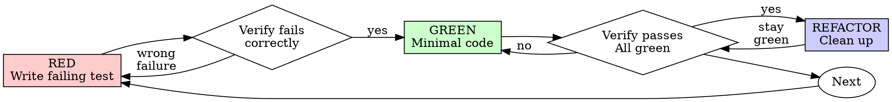

# Test-Driven Development (TDD)

## Purpose

Implements test-driven development methodology - write the test first, watch it fail, write minimal code to pass. Testing time is predictable and efficient with AI assistance.

This skill enforces the discipline of TDD where tests are written BEFORE implementation code, ensuring that every piece of production code has a corresponding failing test first. This guarantees tests actually verify the intended behavior rather than accidentally passing on existing (potentially buggy) implementation.

## Trigger Contract

### Use this skill when
- Implementing any new feature
- Fixing any bug
- Refactoring existing code
- Making behavior changes to code
- The user asks to implement something with tests

### Do NOT use this skill when
- Creating throwaway prototypes (ask human partner first)
- Generating boilerplate code (ask human partner first)
- Writing configuration files (ask human partner first)
- The user wants to test existing code (use a different testing skill)

### Inspect First
- Current test framework and test file locations
- Existing test patterns in the codebase
- Test utilities and helpers available

### Handoff To
- Testing anti-patterns skill for guidance on test patterns to avoid

### Stop Conditions
- When implementation code exists but no tests (violates TDD)
- When tests pass before implementation (wrong test order)

## When Not to Use

### Common Misactivation Scenarios

**Don't use for:**
- One-off debugging sessions
- Exploratory coding (but then discard and start fresh with TDD)
- Documentation-only changes
- Changes that don't affect behavior

### Alternative Skills

| Request | Use Instead |
|---------|-------------|
| "Test existing code" | Testing framework or test execution skill |
| "Run the test suite" | Test runner skill |
| "Add test coverage" | Coverage analysis skill |
| "Debug failing tests" | Debugging skill |

## Inputs

### Required Inputs
- Feature or behavior to implement
- Expected behavior specification (what should happen)
- File/function names being implemented

### Optional Inputs
- Test framework preference (Jest, pytest, etc.)
- Existing test patterns to follow
- Test utilities available in the project

### Input Formats
- Natural language description of desired behavior
- API or function signature to implement
- Requirements or user story

## Output Contract

### Output Mode
- Test file with failing test(s)
- Minimal implementation code to pass tests
- Test execution results

### Required Fields
- Test file with proper naming convention
- Minimum one failing test demonstrating desired behavior
- Implementation code that passes the test

### Output Guarantees

| Guarantee | Required Artifact |
|-----------|-------------------|
| Test-first | Test fails before implementation |
| Minimal code | Implementation only passes test |
| Green verification | All tests pass after implementation |
| Refactor phase | Code cleaned while keeping tests green |

### Validation Rules
- Test must FAIL before code is written
- Test must pass after minimal implementation
- No new test starts until green
- Tests must use real code (mocks only when unavoidable)

### Failure Output
- If code exists before test: reject, require deletion and restart
- If test passes immediately: reject, test is for existing behavior
- If implementation is over-engineered: reject, require minimal code

## Risk and Safety Boundaries

**Risk Level: low** - This skill creates test files and minimal implementation code in the workspace. No destructive operations.

### Trust Boundaries

| Boundary | Trust Level | Notes |
|----------|-------------|-------|
| User input | Untrusted | Validate feature descriptions before implementing |
| Test files | Trusted | Created in designated test directories |
| Implementation code | Trusted | Minimal code written to pass tests only |
| External test frameworks | Untrusted | Don't assume framework availability |

### Primary Risks

| Risk | Mitigation |
|------|------------|
| Test framework not available | Check framework availability before starting |
| Test file conflicts | Use unique naming, check existing files |
| Over-engineered implementation | Enforce minimal code rule strictly |
| Skipping TDD steps | Reject any code before test |

### Basic Safety Rules
1. Never write implementation code before a failing test
2. Always verify test fails for expected reason
3. Delete any code written before tests
4. Keep tests green during refactoring

## Failure Taxonomy

### Standard Failure Classes

| Class | Description | Resolution |
|-------|-------------|------------|
| code_before_test | Implementation code exists before test | Delete code, write test first |
| test_passes_immediately | Test passes before any implementation | Test is for existing behavior, write new test |
| wrong_failure_reason | Test fails but not for expected reason | Verify test actually tests desired behavior |
| over_engineered | Implementation does more than test requires | Write minimal code to pass test |
| test_not_-green | Tests fail after implementation | Fix implementation, not test |

### Expected Failure Behavior

- **code_before_test**: "Delete implementation code, write failing test first following TDD"
- **test_passes_immediately**: "This test passes - it tests existing behavior. Write a NEW test for the feature you want to add"
- **wrong_failure_reason**: "Test failing for unexpected reason. Verify test actually demonstrates the desired behavior"
- **over_engineered**: "Implementation does more than required. Remove extra features, only code to pass the test"
- **test_not_green**: "Implementation failed tests. Fix implementation code, not the test"

## Minimal Context Rules

### Core Required Context

| Information | Source | Required |
|-------------|--------|----------|
| Feature to implement | User request | Yes |
| Expected behavior | User request | Yes |
| Test framework | Project inspection | Yes |
| Test location | Project structure | Yes |

### Context Principle

Keep core context minimal. Beyond the basics, reference:
- Test framework documentation for syntax
- Project test utilities for helpers
- Testing anti-patterns for what to avoid

## Minimum Observability

**This is a Core Required section.** Every skill must define minimum observability requirements.

### Required Logging

Every skill must log the following:

| Event | Description |
|-------|-------------|
| **Trigger** | When the skill is activated (initialization) |
| **Action** | The primary action taken by the skill |
| **Failure** | Any error or failure condition that occurs |

### Logging Format

Logging format is **optional**. Skills may use:
- Simple text logs
- Structured JSON format
- Framework-native logging

### Relationship to Advanced Observability

This minimum observability section is separate from advanced topics like metrics, tracing, and detailed debugging. Advanced topics belong in expanded context loading, not in core required definitions.

## Version Metadata

| Field | Value | Purpose |
|-------|-------|---------|
| version | 1.2.0 | Current skill version |
| skill_schema_version | 1 | Schema identifier |
| deprecated | false | Active skill |
| replaced_by | null | No replacement |
| minimum_openclaw_version | 1.0.0 | Minimum required version |

### Version History
- 1.1.0 - Added Skill Creator v2.4.0 structure
- 1.0.0 - Initial TDD methodology skill

---

## Overview

Write the test first. Watch it fail. Write minimal code to pass.

**Core principle:** If you didn't watch the test fail, you don't know if it tests the right thing.

**Violating the letter of the rules is violating the spirit of the rules.**

## When to Use

**Always:**
- New features
- Bug fixes
- Refactoring
- Behavior changes

**Exceptions (ask your human partner):**
- Throwaway prototypes
- Generated code
- Configuration files

Thinking "skip TDD just this once"? Stop. That's rationalization.

## The Iron Law

```
NO PRODUCTION CODE WITHOUT A FAILING TEST FIRST
```

Write code before the test? Delete it. Start over.

**No exceptions:**
- Don't keep it as "reference"
- Don't "adapt" it while writing tests
- Don't look at it
- Delete means delete

Implement fresh from tests. Period.

## Red-Green-Refactor



### RED - Write Failing Test

Write one minimal test showing what should happen.

<Good>
```typescript
test('retries failed operations 3 times', async () => {
  let attempts = 0;
  const operation = () => {
    attempts++;
    if (attempts < 3) throw new Error('fail');
    return 'success';
  };

  const result = await retryOperation(operation);

  expect(result).toBe('success');
  expect(attempts).toBe(3);
});
```
Clear name, tests real behavior, one thing
</Good>

<Bad>
```typescript
test('retry works', async () => {
  const mock = jest.fn()
    .mockRejectedValueOnce(new Error())
    .mockRejectedValueOnce(new Error())
    .mockResolvedValueOnce('success');
  await retryOperation(mock);
  expect(mock).toHaveBeenCalledTimes(3);
});
```
Vague name, tests mock not code
</Bad>

**Requirements:**
- One behavior
- Clear name
- Real code (no mocks unless unavoidable)

### Verify RED - Watch It Fail

**MANDATORY. Never skip.**

```bash
npm test path/to/test.test.ts
```

Confirm:
- Test fails (not errors)
- Failure message is expected
- Fails because feature missing (not typos)

**Test passes?** You're testing existing behavior. Fix test.

**Test errors?** Fix error, re-run until it fails correctly.

### GREEN - Minimal Code

Write simplest code to pass the test.

<Good>
```typescript
async function retryOperation<T>(fn: () => Promise<T>): Promise<T> {
  for (let i = 0; i < 3; i++) {
    try {
      return await fn();
    } catch (e) {
      if (i === 2) throw e;
    }
  }
  throw new Error('unreachable');
}
```
Just enough to pass
</Good>

<Bad>
```typescript
async function retryOperation<T>(
  fn: () => Promise<T>,
  options?: {
    maxRetries?: number;
    backoff?: 'linear' | 'exponential';
    onRetry?: (attempt: number) => void;
  }
): Promise<T> {
  // YAGNI
}
```
Over-engineered
</Bad>

Don't add features, refactor other code, or "improve" beyond the test.

### Verify GREEN - Watch It Pass

**MANDATORY.**

```bash
npm test path/to/test.test.ts
```

Confirm:
- Test passes
- Other tests still pass
- Output pristine (no errors, warnings)

**Test fails?** Fix code, not test.

**Other tests fail?** Fix now.

### REFACTOR - Clean Up

After green only:
- Remove duplication
- Improve names
- Extract helpers

Keep tests green. Don't add behavior.

### Repeat

Next failing test for next feature.

## Good Tests

| Quality | Good | Bad |
|---------|------|-----|
| **Minimal** | One thing. "and" in name? Split it. | `test('validates email and domain and whitespace')` |
| **Clear** | Name describes behavior | `test('test1')` |
| **Shows intent** | Demonstrates desired API | Obscures what code should do |

## Why Order Matters

**"I'll write tests after to verify it works"**

Tests written after code pass immediately. Passing immediately proves nothing:
- Might test wrong thing
- Might test implementation, not behavior
- Might miss edge cases you forgot
- You never saw it catch the bug

Test-first forces you to see the test fail, proving it actually tests something.

**"I already manually tested all the edge cases"**

Manual testing is ad-hoc. You think you tested everything but:
- No record of what you tested
- Can't re-run when code changes
- Easy to forget cases under pressure
- "It worked when I tried it" ≠ comprehensive

Automated tests are systematic. They run the same way every time.

**"Deleting X hours of work is wasteful"**

Sunk cost fallacy. The time is already gone. Your choice now:
- Delete and rewrite with TDD (X more hours, high confidence)
- Keep it and add tests after (30 min, low confidence, likely bugs)

The "waste" is keeping code you can't trust. Working code without real tests is technical debt.

**"TDD is dogmatic, being pragmatic means adapting"**

TDD IS pragmatic:
- Finds bugs before commit (faster than debugging after)
- Prevents regressions (tests catch breaks immediately)
- Documents behavior (tests show how to use code)
- Enables refactoring (change freely, tests catch breaks)

"Pragmatic" shortcuts = debugging in production = slower.

**"Tests after achieve the same goals - it's spirit not ritual"**

No. Tests-after answer "What does this do?" Tests-first answer "What should this do?"

Tests-after are biased by your implementation. You test what you built, not what's required. You verify remembered edge cases, not discovered ones.

Tests-first force edge case discovery before implementing. Tests-after verify you remembered everything (you didn't).

30 minutes of tests after ≠ TDD. You get coverage, lose proof tests work.

## Common Rationalizations

| Excuse | Reality |
|--------|---------|
| "Too simple to test" | Simple code breaks. Test takes 30 seconds. |
| "I'll test after" | Tests passing immediately prove nothing. |
| "Tests after achieve same goals" | Tests-after = "what does this do?" Tests-first = "what should this do?" |
| "Already manually tested" | Ad-hoc ≠ systematic. No record, can't re-run. |
| "Deleting X hours is wasteful" | Sunk cost fallacy. Keeping unverified code is technical debt. |
| "Keep as reference, write tests first" | You'll adapt it. That's testing after. Delete means delete. |
| "Need to explore first" | Fine. Throw away exploration, start with TDD. |
| "Test hard = design unclear" | Listen to test. Hard to test = hard to use. |
| "TDD will slow me down" | TDD faster than debugging. Pragmatic = test-first. |
| "Manual test faster" | Manual doesn't prove edge cases. You'll re-test every change. |
| "Existing code has no tests" | You're improving it. Add tests for existing code. |

## Red Flags - STOP and Start Over

- Code before test
- Test after implementation
- Test passes immediately
- Can't explain why test failed
- Tests added "later"
- Rationalizing "just this once"
- "I already manually tested it"
- "Tests after achieve the same purpose"
- "It's about spirit not ritual"
- "Keep as reference" or "adapt existing code"
- "Already spent X hours, deleting is wasteful"
- "TDD is dogmatic, I'm being pragmatic"
- "This is different because..."

**All of these mean: Delete code. Start over with TDD.**

## Example: Bug Fix

**Bug:** Empty email accepted

**RED**
```typescript
test('rejects empty email', async () => {
  const result = await submitForm({ email: '' });
  expect(result.error).toBe('Email required');
});
```

**Verify RED**
```bash
$ npm test
FAIL: expected 'Email required', got undefined
```

**GREEN**
```typescript
function submitForm(data: FormData) {
  if (!data.email?.trim()) {
    return { error: 'Email required' };
  }
  // ...
}
```

**Verify GREEN**
```bash
$ npm test
PASS
```

**REFACTOR**
Extract validation for multiple fields if needed.

## Verification Checklist

Before marking work complete:

- [ ] Every new function/method has a test
- [ ] Watched each test fail before implementing
- [ ] Each test failed for expected reason (feature missing, not typo)
- [ ] Wrote minimal code to pass each test
- [ ] All tests pass
- [ ] Output pristine (no errors, warnings)
- [ ] Tests use real code (mocks only if unavoidable)
- [ ] Edge cases and errors covered

Can't check all boxes? You skipped TDD. Start over.

## When Stuck

| Problem | Solution |
|---------|----------|
| Don't know how to test | Write wished-for API. Write assertion first. Ask your human partner. |
| Test too complicated | Design too complicated. Simplify interface. |
| Must mock everything | Code too coupled. Use dependency injection. |
| Test setup huge | Extract helpers. Still complex? Simplify design. |

## Debugging Integration

Bug found? Write failing test reproducing it. Follow TDD cycle. Test proves fix and prevents regression.

Never fix bugs without a test.

## Testing Anti-Patterns

When adding mocks or test utilities, read @testing-anti-patterns.md to avoid common pitfalls:
- Testing mock behavior instead of real behavior
- Adding test-only methods to production classes
- Mocking without understanding dependencies

## Final Rule

```
Production code → test exists and failed first
Otherwise → not TDD
```

No exceptions without your human partner's permission.

## Timeline Estimation for Testing

AI excels at test generation. Use specialized test time estimates:

| Test Type | AI Time | Human Time | Speedup |
|-----------|---------|------------|---------|
| Unit test (single function) | 5-15 min | 30-60 min | 4-6x |
| Integration test (endpoint) | 10-30 min | 1-2 hours | 4-6x |
| Test suite (feature) | 30-60 min | 4-8 hours | 6-8x |
| E2E test scenario | 30-90 min | 2-4 hours | 3-5x |
| Load/performance test | 1-3 hours | 4-8 hours | 3-5x |

**TDD Cycle Time:**
```
TDD_TOTAL = (Write_Test + Verify_Red + Write_Code + Verify_Green + Refactor) × Cycles
```

| Phase | Time per cycle | Notes |
|-------|----------------|-------|
| Write test | 5-15 min | AI is fast at test generation |
| Verify RED | 1-2 min | Run test, confirm failure |
| Write minimal code | 5-30 min | Depends on complexity |
| Verify GREEN | 1-2 min | Run test, confirm pass |
| Refactor | 5-15 min | Optional, improves quality |

**Key insight:** Testing is where AI has the highest speedup factor (10-15x for generated tests). Use `ai-timeline-estimation` skill for test suites.